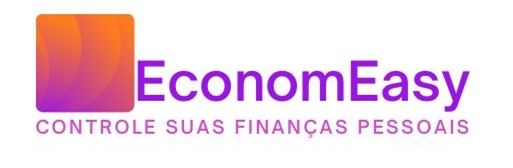

# FECAP - Fundação de Comércio Álvares Penteado

<p align="center">
<a href= "https://www.fecap.br/"></a>
</p>

# EconomEasy

## Grupo 2

## Integrantes: <a href="https://www.linkedin.com/in/bruno-ribas-801934b8/">Bruno Ribas</a>,<a href="https://www.linkedin.com/in/erika-r-b-761186109/">Erika Barros</a>, <a href="https://www.linkedin.com/in/willians-domingues-de-souza-81b367197/">Willians Souza</a>

## Professores Orientadores: <a href="https://www.linkedin.com/in/victorbarq/">Professor Me. Victor Bruno Alexander Rosetti Quiroz</a>

## Descrição

<p align="center">

</p>


Aplicativo de gestão financeira, focado em facilitar a organização monetária das pessoas, de maneira fácil e bem intuitiva para todo os públicos.
<br><br>
Mesmo que o usuário não possua grande conhecimento financeiro, ele consegue se organizar financeiramente criando metas e controle para verificar como está o andamento e organização de suas finanças.
<br><br>

## 🛠 Estrutura de pastas

-Raiz<br>
|<br>
|-->documentos<br>
  &emsp;|-->antigos<br>
  &emsp;|Documentação.docx<br>
|-->executáveis<br>
  &emsp;|-->windows<br>
  &emsp;|-->android<br>
  &emsp;|-->HTML<br>
|-->imagens<br>
|-->src<br>
  &emsp;|-->Backend<br>
  &emsp;|-->Frontend<br>
|readme.md<br>


Há também 4 pastas que seguem da seguinte forma:

<b>documentos</b>: Toda a documentação estará nesta pasta.

<b>executáveis</b>: Binários e executáveis do projeto devem estar nesta pasta.

<b>imagens</b>: Imagens do sistema

<b>src</b>: Pasta que contém o código fonte.

## 🛠 Instalação

<b>Android:</b>

Faça o Download do Aplicativo.apk no seu celular.
Execute o APK e siga as instruções de seu telefone.

```sh
Coloque código do prompt de comnando se for necessário
```

## 💻 Configuração para Desenvolvimento

Descreva como instalar todas as dependências para desenvolvimento e como rodar um test-suite automatizado de algum tipo. Se necessário, faça isso para múltiplas plataformas.
<br>
Para abrir este projeto você necessita das seguintes ferramentas:
<br>
- Smartphone com sistema operacional Android e acesso à PlayStore ou ao acesso ao link de download da APK.


## 🗃 Histórico de lançamentos

A cada atualização os detalhes devem ser lançados aqui.

* 0.2.1 - 25/01/2022
    * MUDANÇA: Atualização de docs (código do módulo permanece inalterado)
* 0.2.0 - 15/01/2022
    * MUDANÇA: Remove `setDefaultXYZ()`
    * ADD: Adiciona `init()`
* 0.1.1 - 11/01/2022
    * CONSERTADO: Crash quando chama `baz()` (Obrigado @NomeDoContribuidorGeneroso!)
* 0.1.0 - 10/01/2022
    * O primeiro lançamento adequado
    * MUDANÇA: Renomeia `foo()` para `bar()`
* 0.0.1 - 01/01/2022
    * Trabalho em andamento

## 📋 Licença/License


## 🎓 Referências

Aqui estão as referências usadas no projeto.

1. <https://www.figma.com/file/kfKX3YHqoK3kOZIAwQCbC6/protótipo?nod-id:0%3A1>

